# ☕ Brownland Coffee Codebase Guide & Mind Map (`memory.md`)

This document serves as the project's **brain map** (or "memory"). It explains how the website is structured, where specific sections are located in the code, and details every piece of media (images/videos) used. 

---

## 🗺️ High-Level Codebase Mind Map

```mermaid
graph TD
    Root[Brownland Project Root] --> App[1. App Folder: Router & Pages]
    Root --> Comp[2. Components Folder: Blocks & Sections]
    Root --> Pub[3. Public Folder: Media Assets]
    Root --> Lib[4. Lib Folder: Data Fetching]
    Root --> Content[5. Content Folder: Blog Articles]

    App --> PageHome[Home Page /]
    App --> PageAbout[About Page /about]
    App --> PageMenu[Menu Page /menu]
    App --> PageFranchise[Franchise Page /franchise]
    App --> PageBlog[Blog Listing /blog]
    App --> PageBlogSlug[Blog Detail /blog/slug]

    Comp --> Navigation[Header & Footer]
    Comp --> HomeSections[Home Sections: Hero, Journey, Best Sellers, Insta, Branches, Contact]
    Comp --> FranchiseSections[Franchise Sections: Why Us, Application Form]
    Comp --> MenuSections[Menu Sections: 4 Large Images]

    Pub --> BestsellerImg[Bestseller Drinks]
    Pub --> JourneyImg[Journey & Branches Photos]
    Pub --> MenuImg[Menu Catalog Cards]
    Pub --> InstaImg[Instagram Mock Posts]
    Pub --> Logos[Logos & Icons]
    
    Content --> BlogMDs[10 Markdown .md posts]
```

---

## 📂 1. Core Folders & What They Do

*   **[`app/`](file:///c:/Users/laksh/OneDrive/Desktop/brownland/brownlandFinals/app)**: Sets up the pages/routes. Every sub-folder with a `page.tsx` becomes a webpage (e.g. `app/about/page.tsx` is `yourdomain.com/about`).
*   **[`components/`](file:///c:/Users/laksh/OneDrive/Desktop/brownland/brownlandFinals/components)**: The visual Lego blocks (e.g. Hero, Footer, Contact Form, Menu, etc.) that build the pages.
*   **[`public/`](file:///c:/Users/laksh/OneDrive/Desktop/brownland/brownlandFinals/public)**: The storehouse for all media files (Images, Logos, Videos, Fonts).
*   **[`content/blog/`](file:///c:/Users/laksh/OneDrive/Desktop/brownland/brownlandFinals/content/blog)**: Contains all the blog post files in Markdown (`.md`) format. To write a new blog post, simply create a new `.md` file here.
*   **[`lib/`](file:///c:/Users/laksh/OneDrive/Desktop/brownland/brownlandFinals/lib)**: Contains helper code (like [`lib/blog.ts`](file:///c:/Users/laksh/OneDrive/Desktop/brownland/brownlandFinals/lib/blog.ts)) that reads the Markdown files and passes them to the blog page.

---

## 📺 2. Visual Layouts & Divs (Page-by-Page Locator)

If you need to change text, layout, or buttons on a specific page, refer to the locators below.

### 🏠 Home Page (`/`)
*   **File location**: [`app/page.tsx`](file:///c:/Users/laksh/OneDrive/Desktop/brownland/brownlandFinals/app/page.tsx)
*   **Structure**:
    1.  **Navigation Bar**: [`components/navbar.tsx`](file:///c:/Users/laksh/OneDrive/Desktop/brownland/brownlandFinals/components/navbar.tsx) (Fixed header with links to Home, About, Menu, Franchise, Blog, Contact).
    2.  **Hero/Welcome Section**: [`components/hero-section.tsx`](file:///c:/Users/laksh/OneDrive/Desktop/brownland/brownlandFinals/components/hero-section.tsx) 
        *   *Layman Details*: Features the title `"Your Daily Dose Of Brownland"`, background photo `BL-HERO.png`, and two buttons: "View Menu" and "Partner With Us".
    3.  **Our Journey (Timeline)**: [`components/about-cafe-section.tsx`](file:///c:/Users/laksh/OneDrive/Desktop/brownland/brownlandFinals/components/about-cafe-section.tsx)
        *   *Layman Details*: A scroll-animated section showing how the brand grew since 2020. Uses three cards:
            *   *Card 1*: Shailendra Nagar branch opening (`/ourjourney/Behind zudio.png`).
            *   *Card 2*: Spreading aroma to Colours Mall and others (`/ourjourney/Colours mall.png`).
            *   *Card 3*: Seventh location opening in Mowa (`/ourjourney/Sarvodya nagar - Copy.png`).
    4.  **Best Sellers**: [`components/best.tsx`](file:///c:/Users/laksh/OneDrive/Desktop/brownland/brownlandFinals/components/best.tsx)
        *   *Layman Details*: Full-screen scroll slides showing flagship drinks (Cappuccino, Iced Latte, nutella latte, Orange Americano, Signature Iced Latte) over a beige background (`#F6EEE5`).
    5.  **Instagram Feed Mock**: [`components/instagram-section.tsx`](file:///c:/Users/laksh/OneDrive/Desktop/brownland/brownlandFinals/components/instagram-section.tsx)
        *   *Layman Details*: A realistic mock of the Instagram feed `@brownlandcoffee` showing profile details, 6 posts that link to actual reels/posts, and follower stats.
    6.  **Our Branches**: [`components/branches-section.tsx`](file:///c:/Users/laksh/OneDrive/Desktop/brownland/brownlandFinals/components/branches-section.tsx)
        *   *Layman Details*: A grid listing all 9 locations with addresses, navigation links, and embedded custom interactive Google Maps widget. Includes CTAs at the bottom to order via Zomato/Swiggy.
    7.  **Contact Form**: [`components/contact-section.tsx`](file:///c:/Users/laksh/OneDrive/Desktop/brownland/brownlandFinals/components/contact-section.tsx)
        *   *Layman Details*: Name/Email/Message fields that redirect the user to WhatsApp upon submission, along with basic business details (Hours, phone, insta link).
    8.  **Footer**: [`components/footer.tsx`](file:///c:/Users/laksh/OneDrive/Desktop/brownland/brownlandFinals/components/footer.tsx)
        *   *Layman Details*: Final dark-brown section with copyrights, social links, and navigation page links.

### 📖 About Page (`/about`)
*   **File location**: [`app/about/page.tsx`](file:///c:/Users/laksh/OneDrive/Desktop/brownland/brownlandFinals/app/about/page.tsx)
*   **Structure**:
    1.  **Navbar**: [`components/navbar.tsx`](file:///c:/Users/laksh/OneDrive/Desktop/brownland/brownlandFinals/components/navbar.tsx)
    2.  **About Hero**: [`components/about-hero.tsx`](file:///c:/Users/laksh/OneDrive/Desktop/brownland/brownlandFinals/components/about-hero.tsx)
        *   *Layman Details*: Clean editorial title "ABOUT US" on top.
    3.  **About Content**: [`components/about-content.tsx`](file:///c:/Users/laksh/OneDrive/Desktop/brownland/brownlandFinals/components/about-content.tsx)
        *   *Layman Details*: Divided into "The Brownland Chronicle" (long editorial write-up about their values) and "Join the Revolution" (six highlighted cards detailing franchise benefits like low fixed royalty, complete support, etc.).
    4.  **Footer**: [`components/footer.tsx`](file:///c:/Users/laksh/OneDrive/Desktop/brownland/brownlandFinals/components/footer.tsx)

### 📋 Menu Page (`/menu`)
*   **File location**: [`app/menu/page.tsx`](file:///c:/Users/laksh/OneDrive/Desktop/brownland/brownlandFinals/app/menu/page.tsx)
*   **Structure**:
    1.  **Navbar**: [`components/navbar.tsx`](file:///c:/Users/laksh/OneDrive/Desktop/brownland/brownlandFinals/components/navbar.tsx)
    2.  **Menu List**: [`components/menu-section.tsx`](file:///c:/Users/laksh/OneDrive/Desktop/brownland/brownlandFinals/components/menu-section.tsx)
        *   *Layman Details*: It displays four large high-quality images representing different sections of their menu (Hot Coffee, Shakes, Sandwiches, Combos).
    3.  **Footer**: [`components/footer.tsx`](file:///c:/Users/laksh/OneDrive/Desktop/brownland/brownlandFinals/components/footer.tsx)

### 🤝 Franchise Page (`/franchise`)
*   **File location**: [`app/franchise/page.tsx`](file:///c:/Users/laksh/OneDrive/Desktop/brownland/brownlandFinals/app/franchise/page.tsx)
*   **Structure**:
    1.  **Franchise Navbar**: [`components/franchise-navbar.tsx`](file:///c:/Users/laksh/OneDrive/Desktop/brownland/brownlandFinals/components/franchise-navbar.tsx) (Slightly customized nav bar highlighting the franchise form action).
    2.  **Franchise Hero**: [`components/franchise-hero.tsx`](file:///c:/Users/laksh/OneDrive/Desktop/brownland/brownlandFinals/components/franchise-hero.tsx)
        *   *Layman Details*: A striking section introducing the franchise model with key statistics (0% royalty share, ₹10,000 fixed fee, fast setup).
    3.  **Why Us Section**: [`components/why-us-section.tsx`](file:///c:/Users/laksh/OneDrive/Desktop/brownland/brownlandFinals/components/why-us-section.tsx)
        *   *Layman Details*: Grid cards showing advantages: Low Royalty, Proven Brand, Full Support, Low Investment, Quality Products, Quick Start.
    4.  **Franchise Application Form**: [`components/franchise-form.tsx`](file:///c:/Users/laksh/OneDrive/Desktop/brownland/brownlandFinals/components/franchise-form.tsx)
        *   *Layman Details*: Forms to collect candidate metadata (Full Name, Age, DOB, Phone, Email, Location). Once submitted, it opens a WhatsApp window pre-filled with this candidate data.
    5.  **Footer**: [`components/footer.tsx`](file:///c:/Users/laksh/OneDrive/Desktop/brownland/brownlandFinals/components/footer.tsx)

---

## 🖼️ 3. Media Asset Catalog

Here is a list of every media file in the project, detailing where it is located, what it is, and where it is shown:

| Category | File Path | Description / Layman Terms | Used In Component |
| :--- | :--- | :--- | :--- |
| **Logos** | [`/BL-LOGO.png`](file:///c:/Users/laksh/OneDrive/Desktop/brownland/brownlandFinals/public/BL-LOGO.png) | Standard small brand logo | Navbar, Footer |
| **Logos** | [`/BL-WHITE-LOGO (1).png`](file:///c:/Users/laksh/OneDrive/Desktop/brownland/brownlandFinals/public/BL-WHITE-LOGO%20%281%29.png) | Large high-resolution white logo | Loading screens/branding |
| **Banners** | [`/BL-HERO.png`](file:///c:/Users/laksh/OneDrive/Desktop/brownland/brownlandFinals/public/BL-HERO.png) | High-contrast coffee cup aesthetic | [`hero-section.tsx`](file:///c:/Users/laksh/OneDrive/Desktop/brownland/brownlandFinals/components/hero-section.tsx) |
| **Bestsellers** | [`/bestseller/hotcappucino.png`](file:///c:/Users/laksh/OneDrive/Desktop/brownland/brownlandFinals/public/bestseller/hotcappucino.png) | Hot Cappuccino cup mockup | [`best.tsx`](file:///c:/Users/laksh/OneDrive/Desktop/brownland/brownlandFinals/components/best.tsx) |
| **Bestsellers** | [`/bestseller/icedlatte.png`](file:///c:/Users/laksh/OneDrive/Desktop/brownland/brownlandFinals/public/bestseller/icedlatte.png) | Iced Latte drink tall cup | [`best.tsx`](file:///c:/Users/laksh/OneDrive/Desktop/brownland/brownlandFinals/components/best.tsx) |
| **Bestsellers** | [`/bestseller/icedlatte(mixed).png`](file:///c:/Users/laksh/OneDrive/Desktop/brownland/brownlandFinals/public/bestseller/icedlatte%28mixed%29.png) | Iced Latte (mixed variant) cup | [`best.tsx`](file:///c:/Users/laksh/OneDrive/Desktop/brownland/brownlandFinals/components/best.tsx) |
| **Bestsellers** | [`/bestseller/icednutellalatte.png`](file:///c:/Users/laksh/OneDrive/Desktop/brownland/brownlandFinals/public/bestseller/icednutellalatte.png) | Iced Nutella hazelnut cup mockup | [`best.tsx`](file:///c:/Users/laksh/OneDrive/Desktop/brownland/brownlandFinals/components/best.tsx) |
| **Bestsellers** | [`/bestseller/orangeAmericano.png`](file:///c:/Users/laksh/OneDrive/Desktop/brownland/brownlandFinals/public/bestseller/orangeAmericano.png) | Zesty Orange Americano cup mockup | [`best.tsx`](file:///c:/Users/laksh/OneDrive/Desktop/brownland/brownlandFinals/components/best.tsx) |
| **Bestsellers** | [`/bestseller/signature_icedlatte.png`](file:///c:/Users/laksh/OneDrive/Desktop/brownland/brownlandFinals/public/bestseller/signature_icedlatte.png) | Special Signature house brew cup | [`best.tsx`](file:///c:/Users/laksh/OneDrive/Desktop/brownland/brownlandFinals/components/best.tsx) |
| **Journey** | [`/ourjourney/Behind zudio.png`](file:///c:/Users/laksh/OneDrive/Desktop/brownland/brownlandFinals/public/ourjourney/Behind%20zudio.png) | Shailendra Nagar branch photo | [`about-cafe-section.tsx`](file:///c:/Users/laksh/OneDrive/Desktop/brownland/brownlandFinals/components/about-cafe-section.tsx) |
| **Journey** | [`/ourjourney/Colours mall.png`](file:///c:/Users/laksh/OneDrive/Desktop/brownland/brownlandFinals/public/ourjourney/Colours%20mall.png) | Colours Mall outlet photo | [`about-cafe-section.tsx`](file:///c:/Users/laksh/OneDrive/Desktop/brownland/brownlandFinals/components/about-cafe-section.tsx) |
| **Journey** | [`/ourjourney/Shankar nagar re baba - Copy.png`](file:///c:/Users/laksh/OneDrive/Desktop/brownland/brownlandFinals/public/ourjourney/Shankar%20nagar%20re%20baba%20-%20Copy.png) | Shankar Nagar outlet photo | [`about-cafe-section.tsx`](file:///c:/Users/laksh/OneDrive/Desktop/brownland/brownlandFinals/components/about-cafe-section.tsx) |
| **Journey** | [`/ourjourney/Sarvodya nagar - Copy.png`](file:///c:/Users/laksh/OneDrive/Desktop/brownland/brownlandFinals/public/ourjourney/Sarvodya%20nagar%20-%20Copy.png) | Sarvodaya Nagar / Tatibandh photo | [`about-cafe-section.tsx`](file:///c:/Users/laksh/OneDrive/Desktop/brownland/brownlandFinals/components/about-cafe-section.tsx) |
| **Doodles** | [`/images/coffee.png`](file:///c:/Users/laksh/OneDrive/Desktop/brownland/brownlandFinals/public/images/coffee.png) | Floating coffee cup cartoon illustration | [`about-cafe-section.tsx`](file:///c:/Users/laksh/OneDrive/Desktop/brownland/brownlandFinals/components/about-cafe-section.tsx) |
| **Doodles** | [`/images/cake.png`](file:///c:/Users/laksh/OneDrive/Desktop/brownland/brownlandFinals/public/images/cake.png) | Floating slice of cake illustration | [`about-cafe-section.tsx`](file:///c:/Users/laksh/OneDrive/Desktop/brownland/brownlandFinals/components/about-cafe-section.tsx) |
| **Doodles** | [`/images/sandwich.png`](file:///c:/Users/laksh/OneDrive/Desktop/brownland/brownlandFinals/public/images/sandwich.png) | Floating sandwich illustration | [`about-cafe-section.tsx`](file:///c:/Users/laksh/OneDrive/Desktop/brownland/brownlandFinals/components/about-cafe-section.tsx) |
| **Doodles** | [`/images/girl.png`](file:///c:/Users/laksh/OneDrive/Desktop/brownland/brownlandFinals/public/images/girl.png) | Floating character girl illustration | [`about-cafe-section.tsx`](file:///c:/Users/laksh/OneDrive/Desktop/brownland/brownlandFinals/components/about-cafe-section.tsx) |
| **Instagram** | [`/images/instagram/profilepicture.jpg`](file:///c:/Users/laksh/OneDrive/Desktop/brownland/brownlandFinals/public/images/instagram/profilepicture.jpg) | Brownland Insta display picture | [`instagram-section.tsx`](file:///c:/Users/laksh/OneDrive/Desktop/brownland/brownlandFinals/components/instagram-section.tsx) |
| **Instagram** | [`/images/instagram/post1.jpg`](file:///c:/Users/laksh/OneDrive/Desktop/brownland/brownlandFinals/public/images/instagram/post1.jpg) to `post6.png` | Six post thumbnail graphics | [`instagram-section.tsx`](file:///c:/Users/laksh/OneDrive/Desktop/brownland/brownlandFinals/components/instagram-section.tsx) |
| **Menu Cards** | [`/images/menu/hotcoffee.png`](file:///c:/Users/laksh/OneDrive/Desktop/brownland/brownlandFinals/public/images/menu/hotcoffee.png) | Full-width Hot Coffee menu graphic | [`menu-section.tsx`](file:///c:/Users/laksh/OneDrive/Desktop/brownland/brownlandFinals/components/menu-section.tsx) |
| **Menu Cards** | [`/images/menu/shake.png`](file:///c:/Users/laksh/OneDrive/Desktop/brownland/brownlandFinals/public/images/menu/shake.png) | Full-width Shakes menu graphic | [`menu-section.tsx`](file:///c:/Users/laksh/OneDrive/Desktop/brownland/brownlandFinals/components/menu-section.tsx) |
| **Menu Cards** | [`/images/menu/sandwich.png`](file:///c:/Users/laksh/OneDrive/Desktop/brownland/brownlandFinals/public/images/menu/sandwich.png) | Full-width Sandwiches menu graphic | [`menu-section.tsx`](file:///c:/Users/laksh/OneDrive/Desktop/brownland/brownlandFinals/components/menu-section.tsx) |
| **Menu Cards** | [`/images/menu/combos.png`](file:///c:/Users/laksh/OneDrive/Desktop/brownland/brownlandFinals/public/images/menu/combos.png) | Full-width Combos menu graphic | [`menu-section.tsx`](file:///c:/Users/laksh/OneDrive/Desktop/brownland/brownlandFinals/components/menu-section.tsx) |
| **Outlets** | [`/outlets/colors/c1.png`](file:///c:/Users/laksh/OneDrive/Desktop/brownland/brownlandFinals/public/outlets/colors/c1.png) to `c3.png` | Extra outlet photos (Colours Mall) | Reserved / Archive |
| **Video** | [`/Doodle_Animation_to_GIF.mp4`](file:///c:/Users/laksh/OneDrive/Desktop/brownland/brownlandFinals/public/Doodle_Animation_to_GIF.mp4) | High quality doodle background video | Reserved / Archive |
| **Asset** | [`/dark-roasted-coffee-beans-scattered-closeup-macro-.jpg`](file:///c:/Users/laksh/OneDrive/Desktop/brownland/brownlandFinals/public/dark-roasted-coffee-beans-scattered-closeup-macro-.jpg) | Scattered coffee beans macro shot | Reserved / Backgrounds |

---

## ⚡ 4. How to Make Quick Changes

*   **To change branch addresses, map URLs, or status**: Edit the `branches` array at the top of [`components/branches-section.tsx`](file:///c:/Users/laksh/OneDrive/Desktop/brownland/brownlandFinals/components/branches-section.tsx#L6).
*   **To change Bestseller products / descriptions / images**: Edit the `ALL_PRODUCTS` array at the top of [`components/best.tsx`](file:///c:/Users/laksh/OneDrive/Desktop/brownland/brownlandFinals/components/best.tsx#L8).
*   **To edit journey dates, titles, and descriptions**: Edit the `JourneyStep` calls inside [`components/about-cafe-section.tsx`](file:///c:/Users/laksh/OneDrive/Desktop/brownland/brownlandFinals/components/about-cafe-section.tsx#L233).
*   **To edit instagram links or pictures**: Update the `POSTS` array at the top of [`components/instagram-section.tsx`](file:///c:/Users/laksh/OneDrive/Desktop/brownland/brownlandFinals/components/instagram-section.tsx#L7).
*   **To edit franchise candidate questions**: Modify the form tags inside [`components/franchise-form.tsx`](file:///c:/Users/laksh/OneDrive/Desktop/brownland/brownlandFinals/components/franchise-form.tsx#L114).
